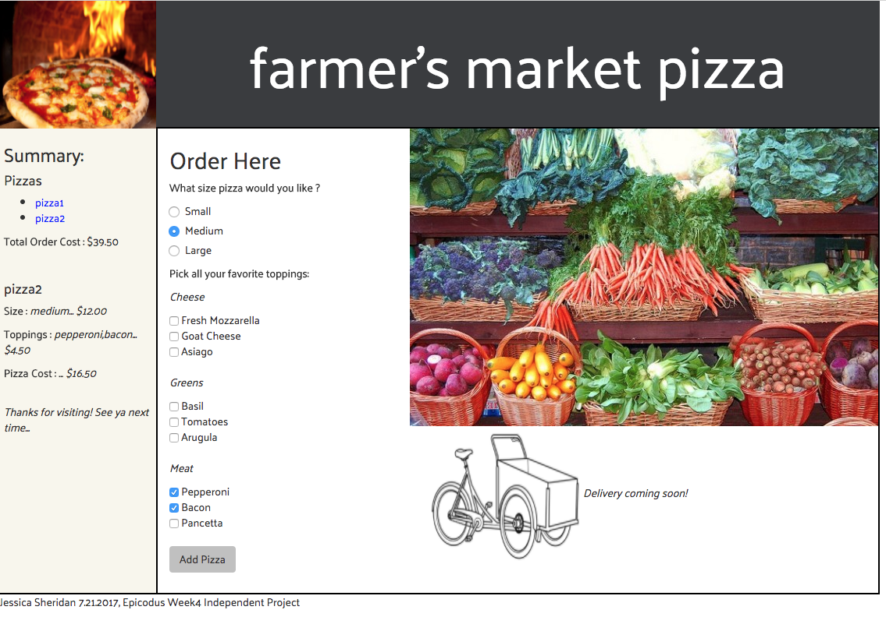

# Pizza-Shop
### Intro to Programming Independent Project for Epicodus Week 4, 07.21.2017

#### By Jessica Sheridan

## Description

This application will provide a pizza company an order form where a user can choose
one or more individual toppings and a pizza size to place an order and display the
final cost. The user can submit any number of pizzas and the individual pizza details
can be shown along with the total cost in the summary sidebar.

## Specifications:

| Behavior      | Input | Output |
| ------------- | ------------- | ------------- |
|1. outputs shows selected pizza size| medium | [medium]|
|2. output shows price of selected size| medium | 10.00 |
|3. output shows selected topping | mushrooms | mushrooms |
|4. output shows price of selected topping | mushrooms | 1.00 |
|5. output shows 2 selected items | basil, mushroom  |[basil,mushroom] |
|6. outputs shows total cost of two items selected| basil, mushroom | [2.00] |
|7. outputs shows total cost of pizza plus toppings | basil, mushroom | [12.00] |

## Setup/Installation Requirements
Clone GitHub Repository:
git clone https://github.com/jessicakenney/pizza-shop.git

## Support and contact details
*email jessicakenney@yahoo.com* with any questions.

## Known Issues/Bugs
In the Summary Sidebar, the 'Toppings' details runs into the main box
 when there are many toppings selected for a given pizza.

## Technologies Used
JavaScript and jQuery

### Legal/License
This software is licensed under MIT
Copyright (c) 2017 Jessica Sheridan
